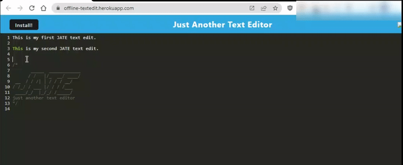

# Installable-Text-Editor

## Description 

This project aims to showcase my ability in building a Progressive Web App text editor that runs in the browser and installs to function offline.




## Usage

In order to do this project, I took starter code and utilized `idb`, a lightweight wrapper around the IndexedDB API, to implement methods for storing and retrieving data.

```Javascript
import { openDB } from 'idb';

//a method that accepts some content and adds it to the database
export const putDb = async (content) => {
  const jateDb = await openDB('jate', 1);
  const tx = jateDb.transaction('jate', 'readwrite');
  const store = tx.objectStore('jate');
  const request = store.add({ content: content });
  const result = await request;
  console.log('🚀 - data saved to the database', result);
};
```

## Links

[Deployed Link](https://offline-textedit.herokuapp.com/)

[Project Repository](https://github.com/zzzorigtbaatar/Installable-Text-Editor)

## Credits

* Jerome Chenette, UC Berkeley Extension Coding BootCamp

* https://www.npmjs.com/package/idb


## License

[LICENSE](/LICENSE)

## Contact

https://www.linkedin.com/in/zorizulkhuu/

https://github.com/zzzorigtbaatar